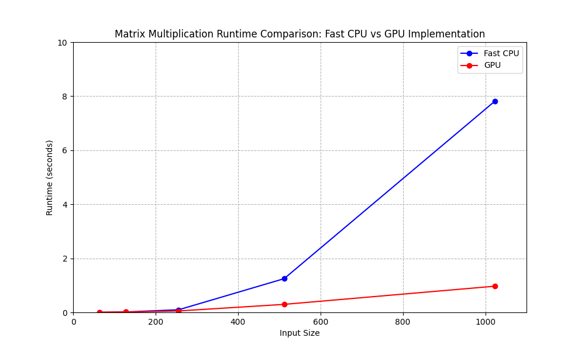

# MiniTorch Module 3


* Docs: https://minitorch.github.io/

* Overview: https://minitorch.github.io/module3.html


You will need to modify `tensor_functions.py` slightly in this assignment.

* Tests:

```
python run_tests.py
```

* Note:

Several of the tests for this assignment will only run if you are on a GPU machine and will not
run on github's test infrastructure. Please follow the instructions to setup up a colab machine
to run these tests.

This assignment requires the following files from the previous assignments. You can get these by running

```bash
python sync_previous_module.py previous-module-dir current-module-dir
```

TASK 3.2 and 3.3 Diagnostics Output:
(mod3env) wy@dhcp-vl2051-136 mod3-JackFishburger % python project/parallel_check.py

MAP
OMP: Info #276: omp_set_nested routine deprecated, please use omp_set_max_active_levels instead.

================================================================================
 Parallel Accelerator Optimizing:  Function tensor_map.<locals>._map, /Users/wy/
Documents/cs5781_mle/workspace/mod3-JackFishburger/minitorch/fast_ops.py (164)
================================================================================


Parallel loop listing for  Function tensor_map.<locals>._map, /Users/wy/Documents/cs5781_mle/workspace/mod3-JackFishburger/minitorch/fast_ops.py (164)
-----------------------------------------------------------------------------------------------|loop #ID
    def _map(                                                                                  |
        out: Storage,                                                                          |
        out_shape: Shape,                                                                      |
        out_strides: Strides,                                                                  |
        in_storage: Storage,                                                                   |
        in_shape: Shape,                                                                       |
        in_strides: Strides,                                                                   |
    ) -> None:                                                                                 |
        # Check if the output and input shapes and strides are identical                       |
        if np.array_equal(out_shape, in_shape) and np.array_equal(out_strides, in_strides):    |
            # Directly apply the function to each element if they are identical                |
            for i in prange(len(out)):---------------------------------------------------------| #2
                out[i] = fn(in_storage[i])                                                     |
            return                                                                             |
                                                                                               |
        # Calculate the total size of the output tensor                                        |
        total_size = len(out)                                                                  |
                                                                                               |
        # Iterate over each element in parallel                                                |
        for i in prange(total_size):-----------------------------------------------------------| #3
            # Initialize index arrays for output and input                                     |
            out_index = np.zeros(MAX_DIMS, np.int32)-------------------------------------------| #0
            in_index = np.zeros(MAX_DIMS, np.int32)--------------------------------------------| #1
                                                                                               |
            # Convert the linear index to a multi-dimensional index for the output             |
            to_index(i, out_shape, out_index)                                                  |
                                                                                               |
            # Map the output index to the input index for broadcasting                         |
            broadcast_index(out_index, out_shape, in_shape, in_index)                          |
                                                                                               |
            # Calculate the storage positions for output and input                             |
            out_pos = index_to_position(out_index, out_strides)                                |
            in_pos = index_to_position(in_index, in_strides)                                   |
                                                                                               |
            # Apply the function to the input and store the result in the output               |
            out[out_pos] = fn(in_storage[in_pos])                                              |
--------------------------------- Fusing loops ---------------------------------
Attempting fusion of parallel loops (combines loops with similar properties)...

Fused loop summary:
+--0 has the following loops fused into it:
   +--1 (fused)
Following the attempted fusion of parallel for-loops there are 3 parallel for-
loop(s) (originating from loops labelled: #2, #3, #0).
--------------------------------------------------------------------------------
---------------------------- Optimising loop nests -----------------------------
Attempting loop nest rewrites (optimising for the largest parallel loops)...

+--3 is a parallel loop
   +--0 --> rewritten as a serial loop
--------------------------------------------------------------------------------
----------------------------- Before Optimisation ------------------------------
Parallel region 0:
+--3 (parallel)
   +--0 (parallel)
   +--1 (parallel)


--------------------------------------------------------------------------------
------------------------------ After Optimisation ------------------------------
Parallel region 0:
+--3 (parallel)
   +--0 (serial, fused with loop(s): 1)


Parallel region 0 (loop #3) had 1 loop(s) fused and 1 loop(s) serialized as part
 of the larger parallel loop (#3).
--------------------------------------------------------------------------------
--------------------------------------------------------------------------------

---------------------------Loop invariant code motion---------------------------
Allocation hoisting:
The memory allocation derived from the instruction at /Users/wy/Documents/cs5781
_mle/workspace/mod3-JackFishburger/minitorch/fast_ops.py (185) is hoisted out of
 the parallel loop labelled #3 (it will be performed before the loop is executed
 and reused inside the loop):
   Allocation:: out_index = np.zeros(MAX_DIMS, np.int32)
    - numpy.empty() is used for the allocation.
The memory allocation derived from the instruction at /Users/wy/Documents/cs5781
_mle/workspace/mod3-JackFishburger/minitorch/fast_ops.py (186) is hoisted out of
 the parallel loop labelled #3 (it will be performed before the loop is executed
 and reused inside the loop):
   Allocation:: in_index = np.zeros(MAX_DIMS, np.int32)
    - numpy.empty() is used for the allocation.
None
ZIP

================================================================================
 Parallel Accelerator Optimizing:  Function tensor_zip.<locals>._zip, /Users/wy/
Documents/cs5781_mle/workspace/mod3-JackFishburger/minitorch/fast_ops.py (226)
================================================================================


Parallel loop listing for  Function tensor_zip.<locals>._zip, /Users/wy/Documents/cs5781_mle/workspace/mod3-JackFishburger/minitorch/fast_ops.py (226)
-----------------------------------------------------------------------|loop #ID
    def _zip(                                                          |
        out: Storage,                                                  |
        out_shape: Shape,                                              |
        out_strides: Strides,                                          |
        a_storage: Storage,                                            |
        a_shape: Shape,                                                |
        a_strides: Strides,                                            |
        b_storage: Storage,                                            |
        b_shape: Shape,                                                |
        b_strides: Strides,                                            |
    ) -> None:                                                         |
        # Check if strides and shapes are aligned                      |
        strides_aligned = (                                            |
            len(out_strides) == len(a_strides) == len(b_strides)       |
            and np.array_equal(out_strides, a_strides)                 |
            and np.array_equal(out_strides, b_strides)                 |
            and np.array_equal(out_shape, a_shape)                     |
            and np.array_equal(out_shape, b_shape)                     |
        )                                                              |
                                                                       |
        if strides_aligned:                                            |
            # Directly apply function if aligned                       |
            for i in prange(out.size):---------------------------------| #7
                out[i] = fn(a_storage[i], b_storage[i])                |
            return                                                     |
                                                                       |
        # Calculate total size for iteration                           |
        size = np.prod(out_shape)--------------------------------------| #8
                                                                       |
        for i in prange(size):-----------------------------------------| #9
            # Initialize index arrays                                  |
            out_index = np.zeros(MAX_DIMS, np.int32)-------------------| #4
            a_index = np.zeros(MAX_DIMS, np.int32)---------------------| #5
            b_index = np.zeros(MAX_DIMS, np.int32)---------------------| #6
                                                                       |
            # Convert linear index to multi-dimensional index          |
            to_index(i, out_shape, out_index)                          |
                                                                       |
            # Map output index to input indices for broadcasting       |
            broadcast_index(out_index, out_shape, a_shape, a_index)    |
            broadcast_index(out_index, out_shape, b_shape, b_index)    |
                                                                       |
            # Calculate storage positions                              |
            a_pos = index_to_position(a_index, a_strides)              |
            b_pos = index_to_position(b_index, b_strides)              |
            out_pos = index_to_position(out_index, out_strides)        |
                                                                       |
            # Apply function and store result                          |
            out[out_pos] = fn(a_storage[a_pos], b_storage[b_pos])      |
--------------------------------- Fusing loops ---------------------------------
Attempting fusion of parallel loops (combines loops with similar properties)...

Fused loop summary:
+--4 has the following loops fused into it:
   +--5 (fused)
   +--6 (fused)
Following the attempted fusion of parallel for-loops there are 4 parallel for-
loop(s) (originating from loops labelled: #7, #8, #9, #4).
--------------------------------------------------------------------------------
---------------------------- Optimising loop nests -----------------------------
Attempting loop nest rewrites (optimising for the largest parallel loops)...

+--9 is a parallel loop
   +--4 --> rewritten as a serial loop
--------------------------------------------------------------------------------
----------------------------- Before Optimisation ------------------------------
Parallel region 0:
+--9 (parallel)
   +--4 (parallel)
   +--5 (parallel)
   +--6 (parallel)


--------------------------------------------------------------------------------
------------------------------ After Optimisation ------------------------------
Parallel region 0:
+--9 (parallel)
   +--4 (serial, fused with loop(s): 5, 6)


Parallel region 0 (loop #9) had 2 loop(s) fused and 1 loop(s) serialized as part
 of the larger parallel loop (#9).
--------------------------------------------------------------------------------
--------------------------------------------------------------------------------

---------------------------Loop invariant code motion---------------------------
Allocation hoisting:
The memory allocation derived from the instruction at /Users/wy/Documents/cs5781
_mle/workspace/mod3-JackFishburger/minitorch/fast_ops.py (257) is hoisted out of
 the parallel loop labelled #9 (it will be performed before the loop is executed
 and reused inside the loop):
   Allocation:: out_index = np.zeros(MAX_DIMS, np.int32)
    - numpy.empty() is used for the allocation.
The memory allocation derived from the instruction at /Users/wy/Documents/cs5781
_mle/workspace/mod3-JackFishburger/minitorch/fast_ops.py (258) is hoisted out of
 the parallel loop labelled #9 (it will be performed before the loop is executed
 and reused inside the loop):
   Allocation:: a_index = np.zeros(MAX_DIMS, np.int32)
    - numpy.empty() is used for the allocation.
The memory allocation derived from the instruction at /Users/wy/Documents/cs5781
_mle/workspace/mod3-JackFishburger/minitorch/fast_ops.py (259) is hoisted out of
 the parallel loop labelled #9 (it will be performed before the loop is executed
 and reused inside the loop):
   Allocation:: b_index = np.zeros(MAX_DIMS, np.int32)
    - numpy.empty() is used for the allocation.
None
REDUCE

================================================================================
 Parallel Accelerator Optimizing:  Function tensor_reduce.<locals>._reduce, /Use
rs/wy/Documents/cs5781_mle/workspace/mod3-JackFishburger/minitorch/fast_ops.py
(300)
================================================================================


Parallel loop listing for  Function tensor_reduce.<locals>._reduce, /Users/wy/Documents/cs5781_mle/workspace/mod3-JackFishburger/minitorch/fast_ops.py (300)
--------------------------------------------------------------------------------|loop #ID
    def _reduce(                                                                |
        out: Storage,                                                           |
        out_shape: Shape,                                                       |
        out_strides: Strides,                                                   |
        a_storage: Storage,                                                     |
        a_shape: Shape,                                                         |
        a_strides: Strides,                                                     |
        reduce_dim: int,                                                        |
    ) -> None:                                                                  |
        total_elements = np.prod(out_shape)-------------------------------------| #11
        dim_size = a_shape[reduce_dim]                                          |
                                                                                |
        for element_index in prange(total_elements):----------------------------| #12
            current_index = np.zeros(MAX_DIMS, np.int32)------------------------| #10
            to_index(element_index, out_shape, current_index)                   |
                                                                                |
            output_position = index_to_position(current_index, out_strides)     |
            current_index[reduce_dim] = 0                                       |
            input_position = index_to_position(current_index, a_strides)        |
                                                                                |
            result = a_storage[input_position]                                  |
                                                                                |
            for dim_index in range(1, dim_size):                                |
                current_index[reduce_dim] = dim_index                           |
                input_position = index_to_position(current_index, a_strides)    |
                result = fn(result, a_storage[input_position])                  |
                                                                                |
            out[output_position] = result                                       |
--------------------------------- Fusing loops ---------------------------------
Attempting fusion of parallel loops (combines loops with similar properties)...
Following the attempted fusion of parallel for-loops there are 3 parallel for-
loop(s) (originating from loops labelled: #11, #12, #10).
--------------------------------------------------------------------------------
---------------------------- Optimising loop nests -----------------------------
Attempting loop nest rewrites (optimising for the largest parallel loops)...

+--12 is a parallel loop
   +--10 --> rewritten as a serial loop
--------------------------------------------------------------------------------
----------------------------- Before Optimisation ------------------------------
Parallel region 0:
+--12 (parallel)
   +--10 (parallel)


--------------------------------------------------------------------------------
------------------------------ After Optimisation ------------------------------
Parallel region 0:
+--12 (parallel)
   +--10 (serial)


Parallel region 0 (loop #12) had 0 loop(s) fused and 1 loop(s) serialized as
part of the larger parallel loop (#12).
--------------------------------------------------------------------------------
--------------------------------------------------------------------------------

---------------------------Loop invariant code motion---------------------------
Allocation hoisting:
The memory allocation derived from the instruction at /Users/wy/Documents/cs5781
_mle/workspace/mod3-JackFishburger/minitorch/fast_ops.py (313) is hoisted out of
 the parallel loop labelled #12 (it will be performed before the loop is
executed and reused inside the loop):
   Allocation:: current_index = np.zeros(MAX_DIMS, np.int32)
    - numpy.empty() is used for the allocation.
None
MATRIX MULTIPLY

================================================================================
 Parallel Accelerator Optimizing:  Function _tensor_matrix_multiply, /Users/wy/D
ocuments/cs5781_mle/workspace/mod3-JackFishburger/minitorch/fast_ops.py (332)
================================================================================


Parallel loop listing for  Function _tensor_matrix_multiply, /Users/wy/Documents/cs5781_mle/workspace/mod3-JackFishburger/minitorch/fast_ops.py (332)
---------------------------------------------------------------------------------------------------------------|loop #ID
def _tensor_matrix_multiply(                                                                                   |
    out: Storage,                                                                                              |
    out_shape: Shape,                                                                                          |
    out_strides: Strides,                                                                                      |
    a_storage: Storage,                                                                                        |
    a_shape: Shape,                                                                                            |
    a_strides: Strides,                                                                                        |
    b_storage: Storage,                                                                                        |
    b_shape: Shape,                                                                                            |
    b_strides: Strides,                                                                                        |
) -> None:                                                                                                     |
    """NUMBA tensor matrix multiply function.                                                                  |
                                                                                                               |
    Should work for any tensor shapes that broadcast as long as                                                |
                                                                                                               |
    ```                                                                                                        |
    assert a_shape[-1] == b_shape[-2]                                                                          |
    ```                                                                                                        |
                                                                                                               |
    Optimizations:                                                                                             |
                                                                                                               |
    * Outer loop in parallel                                                                                   |
    * No index buffers or function calls                                                                       |
    * Inner loop should have no global writes, 1 multiply.                                                     |
                                                                                                               |
                                                                                                               |
    Args:                                                                                                      |
    ----                                                                                                       |
        out (Storage): storage for `out` tensor                                                                |
        out_shape (Shape): shape for `out` tensor                                                              |
        out_strides (Strides): strides for `out` tensor                                                        |
        a_storage (Storage): storage for `a` tensor                                                            |
        a_shape (Shape): shape for `a` tensor                                                                  |
        a_strides (Strides): strides for `a` tensor                                                            |
        b_storage (Storage): storage for `b` tensor                                                            |
        b_shape (Shape): shape for `b` tensor                                                                  |
        b_strides (Strides): strides for `b` tensor                                                            |
                                                                                                               |
    Returns:                                                                                                   |
    -------                                                                                                    |
        None : Fills in `out`                                                                                  |
                                                                                                               |
    """                                                                                                        |
    reduced_size = a_shape[2]                                                                                  |
    a_batch_s, b_batch_s = (a_strides[0] if a_shape[0] > 1 else 0), (b_strides[0] if b_shape[0] > 1 else 0)    |
    a_row_s, a_col_s = a_strides[1], a_strides[2]                                                              |
    b_row_s, b_col_s = b_strides[1], b_strides[2]                                                              |
                                                                                                               |
    for batch in prange(out_shape[0]):-------------------------------------------------------------------------| #13
        for i in range(out_shape[1]):                                                                          |
            for j in range(out_shape[2]):                                                                      |
                out_pos = batch * out_strides[0] + i * out_strides[1] + j * out_strides[2]                     |
                total = 0.0                                                                                    |
                a_in, b_in = batch * a_batch_s + i * a_row_s, batch * b_batch_s + j * b_col_s                  |
                                                                                                               |
                for k in range(reduced_size):                                                                  |
                    total += a_storage[a_in + k * a_col_s] * b_storage[b_in + k * b_row_s]                     |
                                                                                                               |
                out[out_pos] = total                                                                           |
--------------------------------- Fusing loops ---------------------------------
Attempting fusion of parallel loops (combines loops with similar properties)...
Following the attempted fusion of parallel for-loops there are 1 parallel for-
loop(s) (originating from loops labelled: #13).
--------------------------------------------------------------------------------
----------------------------- Before Optimisation ------------------------------
--------------------------------------------------------------------------------
------------------------------ After Optimisation ------------------------------
Parallel structure is already optimal.
--------------------------------------------------------------------------------
--------------------------------------------------------------------------------

---------------------------Loop invariant code motion---------------------------
Allocation hoisting:
No allocation hoisting found
None

Task 3.4:
Command:
!cd $DIR; python timing.py

Output:
{'fast': 0.0035114288330078125, 'gpu': 0.006440798441569011}
Running size 128
{'fast': 0.016477584838867188, 'gpu': 0.014967918395996094}
Running size 256
{'fast': 0.09692056973775227, 'gpu': 0.05311258633931478}
Running size 512
{'fast': 1.2479018370310466, 'gpu': 0.29705055554707843}
Running size 1024
{'fast': 7.824625730514526, 'gpu': 0.9703116416931152}

Timing summary
Size: 64
    fast: 0.00351
    gpu: 0.00644
Size: 128
    fast: 0.01648
    gpu: 0.01497
Size: 256
    fast: 0.09692
    gpu: 0.05311
Size: 512
    fast: 1.24790
    gpu: 0.29705
Size: 1024
    fast: 7.82463
    gpu: 0.97031

Graph:



Task 3.5:
CPU
Simple:
!cd $DIR; PYTHONPATH=/content/$DIR python3.11 project/run_fast_tensor.py --BACKEND cpu --HIDDEN 100 --DATASET simple --RATE 0.05
Epoch  0  loss  9.25241808062146 correct 27 time 22.81747794151306
Epoch  10  loss  5.0187117254731834 correct 43 time 0.08810043334960938
Epoch  20  loss  3.4849419018449375 correct 42 time 0.1005849838256836
Epoch  30  loss  3.254809971870006 correct 41 time 0.08628249168395996
Epoch  40  loss  3.9306085266415156 correct 48 time 0.08761930465698242
Epoch  50  loss  2.7060960879593727 correct 48 time 0.08791351318359375
Epoch  60  loss  1.5283440674155755 correct 48 time 0.08770060539245605
Epoch  70  loss  1.4565949427682685 correct 50 time 0.08672428131103516
Epoch  80  loss  1.7554564921026548 correct 50 time 0.0935063362121582
Epoch  90  loss  1.0395028090376228 correct 50 time 0.08649563789367676
Epoch  100  loss  1.079527559125645 correct 50 time 0.0869598388671875
Epoch  110  loss  0.20122538520663774 correct 50 time 0.2048943042755127
Epoch  120  loss  1.0019886286232869 correct 50 time 0.21783113479614258
Epoch  130  loss  0.7913203482604839 correct 50 time 0.08788084983825684
Epoch  140  loss  0.735872938243008 correct 50 time 0.10182452201843262
Epoch  150  loss  0.7211065426438058 correct 50 time 0.0896601676940918
Epoch  160  loss  0.1267681793105694 correct 50 time 0.09086966514587402
Epoch  170  loss  0.938332390531791 correct 50 time 0.08726191520690918
Epoch  180  loss  0.33605657780980946 correct 50 time 0.08831357955932617
Epoch  190  loss  0.2528039241426817 correct 50 time 0.0957481861114502
Epoch  200  loss  0.9712065721397821 correct 50 time 0.09229683876037598
Epoch  210  loss  0.29900416353512194 correct 50 time 0.08707237243652344
Epoch  220  loss  0.5441542693269595 correct 50 time 0.0873866081237793
Epoch  230  loss  0.5002248508366741 correct 50 time 0.08741545677185059
Epoch  240  loss  0.7054407666529818 correct 50 time 0.09483480453491211
Epoch  250  loss  0.4461971487488266 correct 50 time 0.19617772102355957
Epoch  260  loss  0.28089364975820197 correct 50 time 0.08742690086364746
Epoch  270  loss  0.6004501962256886 correct 50 time 0.08790016174316406
Epoch  280  loss  0.46937167194429 correct 50 time 0.08870363235473633
Epoch  290  loss  0.3849221760534427 correct 50 time 0.08789420127868652
Epoch  300  loss  0.19435466532890514 correct 50 time 0.0868377685546875
Epoch  310  loss  0.20662074311840267 correct 50 time 0.08961653709411621
Epoch  320  loss  0.7604081247749305 correct 50 time 0.08694911003112793
Epoch  330  loss  0.28633392776956046 correct 50 time 0.08850407600402832
Epoch  340  loss  0.37538290616659636 correct 50 time 0.09144830703735352
Epoch  350  loss  0.29329720924652175 correct 50 time 0.08747506141662598
Epoch  360  loss  0.5942163412672211 correct 50 time 0.08827495574951172
Epoch  370  loss  0.15549962064487147 correct 50 time 0.08788633346557617
Epoch  380  loss  0.11730511081040931 correct 50 time 0.12521982192993164
Epoch  390  loss  0.27061398095873085 correct 50 time 0.13648724555969238
Epoch  400  loss  0.11186493848189151 correct 50 time 0.09235501289367676
Epoch  410  loss  0.18931034895728227 correct 50 time 0.08846807479858398
Epoch  420  loss  0.2744852603901164 correct 50 time 0.08727669715881348
Epoch  430  loss  0.10638871184084538 correct 50 time 0.08756804466247559
Epoch  440  loss  0.09557990596275849 correct 50 time 0.09728145599365234
Epoch  450  loss  0.1558829758492686 correct 50 time 0.08916544914245605
Epoch  460  loss  0.20041465661150112 correct 50 time 0.08818936347961426
Epoch  470  loss  0.06721864210232675 correct 50 time 0.0862581729888916
Epoch  480  loss  0.24453184141857903 correct 50 time 0.08786964416503906
Epoch  490  loss  0.06231818135340682 correct 50 time 0.09711360931396484

Simple 200:
!cd $DIR; PYTHONPATH=/content/$DIR python3.11 project/run_fast_tensor.py --BACKEND cpu --HIDDEN 200 --DATASET simple --RATE 0.05
Epoch  0  loss  5.9389108674948705 correct 43 time 24.031527996063232
Epoch  10  loss  0.6189816983642062 correct 50 time 0.20042943954467773
Epoch  20  loss  1.4568134493438023 correct 49 time 0.2285919189453125
Epoch  30  loss  0.7420451975928736 correct 49 time 0.40831518173217773
Epoch  40  loss  0.6893048793950689 correct 50 time 0.21571850776672363
Epoch  50  loss  0.17241009284365622 correct 50 time 0.19939947128295898
Epoch  60  loss  0.05265437489545163 correct 50 time 0.20034551620483398
Epoch  70  loss  0.22328968688020576 correct 50 time 0.19799208641052246
Epoch  80  loss  0.5189978639569454 correct 50 time 0.19952392578125
Epoch  90  loss  0.14608489612990408 correct 50 time 0.3318638801574707
Epoch  100  loss  0.07685172546861194 correct 50 time 0.20065808296203613
Epoch  110  loss  0.06599412490781786 correct 50 time 0.20733928680419922
Epoch  120  loss  0.14456477303262125 correct 50 time 0.19671893119812012
Epoch  130  loss  0.07228824538079046 correct 50 time 0.19327878952026367
Epoch  140  loss  0.7586226335370937 correct 50 time 0.19384407997131348
Epoch  150  loss  0.08251264679999547 correct 50 time 0.3702878952026367
Epoch  160  loss  0.002401845716100733 correct 50 time 0.2014920711517334
Epoch  170  loss  0.04948326795859939 correct 50 time 0.20176911354064941
Epoch  180  loss  0.114968244517408 correct 50 time 0.21303105354309082
Epoch  190  loss  0.017124936695195866 correct 50 time 0.19806575775146484
Epoch  200  loss  0.1291958913413667 correct 50 time 0.19643115997314453
Epoch  210  loss  0.02388060494759604 correct 50 time 0.20109176635742188
Epoch  220  loss  0.4042988793568518 correct 50 time 0.20426487922668457
Epoch  230  loss  0.05959669742650808 correct 50 time 0.20039987564086914
Epoch  240  loss  0.033763657230844964 correct 50 time 0.1984708309173584
Epoch  250  loss  0.12792026007372614 correct 50 time 0.21024036407470703
Epoch  260  loss  0.11840649354211029 correct 50 time 0.20865130424499512
Epoch  270  loss  0.15748894341345737 correct 50 time 0.19971752166748047
Epoch  280  loss  0.44908361178457706 correct 50 time 0.19979453086853027
Epoch  290  loss  0.07769578536962497 correct 50 time 0.19786310195922852
Epoch  300  loss  0.3020846457681889 correct 50 time 0.1982860565185547
Epoch  310  loss  0.0798070286085715 correct 50 time 0.2109084129333496
Epoch  320  loss  0.41991630014038905 correct 50 time 0.1970996856689453
Epoch  330  loss  0.0890329430867497 correct 50 time 0.2115318775177002
Epoch  340  loss  0.028326010137385373 correct 50 time 0.21343088150024414
Epoch  350  loss  0.028807221417237246 correct 50 time 0.19782519340515137
Epoch  360  loss  0.24946717947901773 correct 50 time 0.19247913360595703
Epoch  370  loss  0.4223914005682883 correct 50 time 0.19251227378845215
Epoch  380  loss  0.021927729804215212 correct 50 time 0.19242429733276367
Epoch  390  loss  0.006571786964822105 correct 50 time 0.20191431045532227
Epoch  400  loss  0.059072251866149984 correct 50 time 0.20997357368469238
Epoch  410  loss  0.00041338647181229866 correct 50 time 0.19541120529174805
Epoch  420  loss  0.25741736681612387 correct 50 time 0.19763588905334473
Epoch  430  loss  0.24262127311531928 correct 50 time 0.20034289360046387
Epoch  440  loss  0.000375595706539699 correct 50 time 0.2010338306427002
Epoch  450  loss  0.0009723679582381326 correct 50 time 0.20634222030639648
Epoch  460  loss  0.32540003272761947 correct 50 time 0.20800495147705078
Epoch  470  loss  0.031117536813050156 correct 50 time 0.21008634567260742
Epoch  480  loss  0.014411481311765447 correct 50 time 0.21195411682128906
Epoch  490  loss  0.012755036289838432 correct 50 time 0.19680452346801758

Split:
!cd $DIR; PYTHONPATH=/content/$DIR python3.11 project/run_fast_tensor.py --BACKEND cpu --HIDDEN 100 --DATASET split --RATE 0.05
Epoch  0  loss  4.298107157175864 correct 34 time 25.30163288116455
Epoch  10  loss  5.479723088570705 correct 42 time 0.09175324440002441
Epoch  20  loss  4.054513591821425 correct 40 time 0.09463953971862793
Epoch  30  loss  5.388372899194938 correct 43 time 0.19588065147399902
Epoch  40  loss  5.943197861748328 correct 43 time 0.22204351425170898
Epoch  50  loss  2.0590187630609673 correct 44 time 0.09004449844360352
Epoch  60  loss  2.8196388215622 correct 43 time 0.09801983833312988
Epoch  70  loss  2.5211452235671215 correct 46 time 0.09348464012145996
Epoch  80  loss  1.7681894212853246 correct 46 time 0.09426236152648926
Epoch  90  loss  2.5333656325881404 correct 48 time 0.09501433372497559
Epoch  100  loss  2.727803807327815 correct 48 time 0.09451985359191895
Epoch  110  loss  2.195839513325076 correct 50 time 0.10427260398864746
Epoch  120  loss  1.1530343277310802 correct 47 time 0.09334850311279297
Epoch  130  loss  1.0895406049578618 correct 48 time 0.09247899055480957
Epoch  140  loss  0.8693494191066606 correct 50 time 0.09152483940124512
Epoch  150  loss  1.108079965683331 correct 50 time 0.08870434761047363
Epoch  160  loss  1.007631477804777 correct 50 time 0.22035765647888184
Epoch  170  loss  1.0386050096914425 correct 49 time 0.17925333976745605
Epoch  180  loss  0.7550756931942865 correct 49 time 0.09239554405212402
Epoch  190  loss  0.8365696329834659 correct 46 time 0.09524869918823242
Epoch  200  loss  0.7180777626256832 correct 50 time 0.0948479175567627
Epoch  210  loss  1.5797603815962067 correct 50 time 0.09065771102905273
Epoch  220  loss  0.4734817852122462 correct 50 time 0.09652423858642578
Epoch  230  loss  1.0802238491084402 correct 50 time 0.09249472618103027
Epoch  240  loss  1.3091656696169087 correct 47 time 0.0912935733795166
Epoch  250  loss  0.9135701245846087 correct 48 time 0.09396672248840332
Epoch  260  loss  0.9235224294240019 correct 48 time 0.09012007713317871
Epoch  270  loss  1.7077317623015706 correct 50 time 0.08995938301086426
Epoch  280  loss  1.4177730901906218 correct 50 time 0.09540510177612305
Epoch  290  loss  1.4283111319254949 correct 46 time 0.21306633949279785
Epoch  300  loss  1.07193098489494 correct 50 time 0.1859588623046875
Epoch  310  loss  0.6039255579493444 correct 50 time 0.08958864212036133
Epoch  320  loss  1.5867382882715517 correct 50 time 0.09306168556213379
Epoch  330  loss  1.3347303275097622 correct 50 time 0.10241985321044922
Epoch  340  loss  0.6811113906548056 correct 50 time 0.09566020965576172
Epoch  350  loss  1.1087012609499278 correct 50 time 0.09368300437927246
Epoch  360  loss  0.2657721113616709 correct 48 time 0.09390425682067871
Epoch  370  loss  1.112024646553253 correct 48 time 0.0924978256225586
Epoch  380  loss  0.19863492709573066 correct 50 time 0.0929110050201416
Epoch  390  loss  1.0691781472462742 correct 50 time 0.09585881233215332
Epoch  400  loss  0.7225806509725088 correct 48 time 0.11190438270568848
Epoch  410  loss  0.18546764890103254 correct 48 time 0.09426116943359375
Epoch  420  loss  0.919662287172363 correct 48 time 0.22242975234985352
Epoch  430  loss  1.0821449152102005 correct 50 time 0.2021040916442871
Epoch  440  loss  0.09693095386473649 correct 50 time 0.09358716011047363
Epoch  450  loss  0.2658287082537292 correct 50 time 0.09426641464233398
Epoch  460  loss  0.18314981562269514 correct 50 time 0.09221935272216797
Epoch  470  loss  0.9946247449788602 correct 50 time 0.09336209297180176
Epoch  480  loss  0.4436025711351306 correct 48 time 0.09245133399963379
Epoch  490  loss  0.35777676005905357 correct 50 time 0.10616254806518555

Xor:
!cd $DIR; PYTHONPATH=/content/$DIR python3.11 project/run_fast_tensor.py --BACKEND cpu --HIDDEN 100 --DATASET xor --RATE 0.05
Epoch  0  loss  7.714984587649593 correct 29 time 24.60503625869751
Epoch  10  loss  3.906832721372432 correct 39 time 0.09507155418395996
Epoch  20  loss  4.8797380762431715 correct 44 time 0.09920001029968262
Epoch  30  loss  2.321555035107872 correct 44 time 0.10961556434631348
Epoch  40  loss  2.068156803698187 correct 47 time 0.1276566982269287
Epoch  50  loss  3.4726495406126254 correct 46 time 0.18731117248535156
Epoch  60  loss  2.276822936199895 correct 49 time 0.09259772300720215
Epoch  70  loss  2.4578378682405027 correct 47 time 0.09403634071350098
Epoch  80  loss  2.1460919230407702 correct 49 time 0.11293172836303711
Epoch  90  loss  1.8390444032929758 correct 50 time 0.0958864688873291
Epoch  100  loss  0.23454668808354012 correct 50 time 0.093231201171875
Epoch  110  loss  1.595494720620879 correct 50 time 0.10501885414123535
Epoch  120  loss  0.9552354382735608 correct 50 time 0.09140205383300781
Epoch  130  loss  1.0481093748129358 correct 50 time 0.0923459529876709
Epoch  140  loss  0.46614312751672693 correct 50 time 0.09180402755737305
Epoch  150  loss  1.107662641352508 correct 50 time 0.09542107582092285
Epoch  160  loss  0.4861225264687362 correct 50 time 0.09498953819274902
Epoch  170  loss  1.5103042806245768 correct 50 time 0.15674257278442383
Epoch  180  loss  0.6508572719201725 correct 50 time 0.15327191352844238
Epoch  190  loss  1.0737778310061863 correct 50 time 0.09858822822570801
Epoch  200  loss  0.4192083294116308 correct 50 time 0.10002636909484863
Epoch  210  loss  0.21292800634064055 correct 50 time 0.09372448921203613
Epoch  220  loss  0.36920964290540104 correct 50 time 0.09131836891174316
Epoch  230  loss  0.460128524355986 correct 50 time 0.09685420989990234
Epoch  240  loss  0.6657846921026755 correct 50 time 0.10669398307800293
Epoch  250  loss  0.15684683911680153 correct 50 time 0.09785699844360352
Epoch  260  loss  0.10620620265057962 correct 50 time 0.09111618995666504
Epoch  270  loss  0.08093239199381898 correct 50 time 0.09293961524963379
Epoch  280  loss  0.1156212192163377 correct 50 time 0.09287786483764648
Epoch  290  loss  0.036783002954367164 correct 50 time 0.09160137176513672
Epoch  300  loss  0.21966708326049908 correct 50 time 0.11214399337768555
Epoch  310  loss  0.23806190909999417 correct 50 time 0.15506672859191895
Epoch  320  loss  0.14105386112930354 correct 50 time 0.0923004150390625
Epoch  330  loss  0.1517682297718337 correct 50 time 0.10432982444763184
Epoch  340  loss  0.3443906011433613 correct 50 time 0.09268832206726074
Epoch  350  loss  0.12563287799596798 correct 50 time 0.09543561935424805
Epoch  360  loss  0.1933445918345819 correct 50 time 0.09296154975891113
Epoch  370  loss  0.08510773099545889 correct 50 time 0.09405303001403809
Epoch  380  loss  0.5874789579777987 correct 50 time 0.09025025367736816
Epoch  390  loss  0.041079020883295625 correct 50 time 0.09091997146606445
Epoch  400  loss  0.28126624305335296 correct 50 time 0.10056948661804199
Epoch  410  loss  0.18397070615369215 correct 50 time 0.09485864639282227
Epoch  420  loss  0.3096394309109591 correct 50 time 0.09332799911499023
Epoch  430  loss  0.25876241089952395 correct 50 time 0.1530914306640625
Epoch  440  loss  0.21741236802171884 correct 50 time 0.1386430263519287
Epoch  450  loss  0.17258942962113882 correct 50 time 0.09404516220092773
Epoch  460  loss  0.12403664650021547 correct 50 time 0.10138535499572754
Epoch  470  loss  0.25724380780667383 correct 50 time 0.1705923080444336
Epoch  480  loss  0.1617198728640299 correct 50 time 0.09096407890319824
Epoch  490  loss  0.1622962335997073 correct 50 time 0.08983778953552246

GPU
Simple:
!cd $DIR; PYTHONPATH=/content/$DIR python3.11 project/run_fast_tensor.py --BACKEND gpu --HIDDEN 100 --DATASET simple --RATE 0.05
Epoch  0  loss  6.587141761250894 correct 26 time 3.761979103088379
Epoch  10  loss  2.3662829049020218 correct 48 time 1.19417405128479
Epoch  20  loss  0.7871858643162706 correct 49 time 1.1496608257293701
Epoch  30  loss  1.489372404667894 correct 50 time 1.1426539421081543
Epoch  40  loss  0.36999124020055746 correct 50 time 1.2031807899475098
Epoch  50  loss  0.7031027713361874 correct 50 time 1.1516282558441162
Epoch  60  loss  0.1945153386904254 correct 49 time 1.1350350379943848
Epoch  70  loss  0.6883384311148298 correct 50 time 1.1345596313476562
Epoch  80  loss  1.4596451576253464 correct 49 time 1.1305882930755615
Epoch  90  loss  0.14629456857476178 correct 49 time 1.1325914859771729
Epoch  100  loss  0.7207013173208691 correct 50 time 1.1315622329711914
Epoch  110  loss  0.04405148183931653 correct 50 time 1.1288583278656006
Epoch  120  loss  0.06996391726149245 correct 50 time 1.1332249641418457
Epoch  130  loss  0.8256504217786984 correct 50 time 1.133910894393921
Epoch  140  loss  0.0032148561288518097 correct 50 time 1.2565155029296875
Epoch  150  loss  0.7488048747431421 correct 50 time 1.5188877582550049
Epoch  160  loss  0.26623851863510983 correct 50 time 1.7124402523040771
Epoch  170  loss  0.01847250746822201 correct 50 time 1.8125667572021484
Epoch  180  loss  0.6965198876111783 correct 50 time 1.5325429439544678
Epoch  190  loss  0.012466757680359297 correct 49 time 1.3422067165374756
Epoch  200  loss  0.1435710734771593 correct 50 time 1.1295709609985352
Epoch  210  loss  0.7383261959803443 correct 50 time 1.1327064037322998
Epoch  220  loss  0.1276939073247018 correct 50 time 1.1241557598114014
Epoch  230  loss  1.1001560272708781 correct 50 time 1.153686285018921
Epoch  240  loss  0.024414986075185777 correct 50 time 1.1256537437438965
Epoch  250  loss  0.024246170890857604 correct 50 time 1.1485960483551025
Epoch  260  loss  0.2694024787517902 correct 50 time 1.1302924156188965
Epoch  270  loss  0.046580641441178905 correct 50 time 1.1994893550872803
Epoch  280  loss  0.11829698750835195 correct 50 time 1.1297905445098877
Epoch  290  loss  0.9776325193230088 correct 50 time 1.136465072631836
Epoch  300  loss  0.0061168576278506125 correct 50 time 1.1379458904266357
Epoch  310  loss  0.09646601443005565 correct 50 time 1.1338555812835693
Epoch  320  loss  0.02887379981042611 correct 50 time 1.1279950141906738
Epoch  330  loss  0.018415801000439352 correct 50 time 1.1421356201171875
Epoch  340  loss  0.059714779105238924 correct 50 time 1.171741247177124
Epoch  350  loss  0.019588884818028538 correct 50 time 1.1241645812988281
Epoch  360  loss  0.814909916672262 correct 49 time 1.1369574069976807
Epoch  370  loss  0.8451620291578247 correct 50 time 1.1274385452270508
Epoch  380  loss  0.004437745056178949 correct 50 time 1.1301071643829346
Epoch  390  loss  0.5549504477729919 correct 50 time 1.124405860900879
Epoch  400  loss  0.6157935125475293 correct 50 time 1.1987028121948242
Epoch  410  loss  0.032101184845505615 correct 50 time 1.3511536121368408
Epoch  420  loss  0.8220307842207493 correct 50 time 1.5811500549316406
Epoch  430  loss  0.0028234433209225474 correct 50 time 1.7835183143615723
Epoch  440  loss  0.0010486464810652786 correct 50 time 1.618741512298584
Epoch  450  loss  0.04282019019647065 correct 50 time 1.4427318572998047
Epoch  460  loss  0.07724767540984832 correct 50 time 1.6438226699829102
Epoch  470  loss  0.008534038294726543 correct 50 time 1.3624224662780762
Epoch  480  loss  0.5797676097328331 correct 50 time 1.1356761455535889
Epoch  490  loss  0.0522586577716476 correct 50 time 1.1826941967010498

Split:
!cd $DIR; PYTHONPATH=/content/$DIR python3.11 project/run_fast_tensor.py --BACKEND gpu --HIDDEN 100 --DATASET split --RATE 0.05
Epoch  0  loss  6.342020589805261 correct 35 time 3.969994306564331
Epoch  10  loss  3.8422190457179193 correct 35 time 1.1960673332214355
Epoch  20  loss  4.852637936049301 correct 37 time 1.1327731609344482
Epoch  30  loss  3.1589308005730454 correct 42 time 1.1320710182189941
Epoch  40  loss  3.0385166068938814 correct 39 time 1.2015690803527832
Epoch  50  loss  3.970959129828072 correct 46 time 1.132805585861206
Epoch  60  loss  3.412014344410543 correct 47 time 1.1501429080963135
Epoch  70  loss  4.311861479513677 correct 45 time 1.1442580223083496
Epoch  80  loss  2.9762582260110793 correct 49 time 1.1264839172363281
Epoch  90  loss  2.6629992311964017 correct 49 time 1.2437419891357422
Epoch  100  loss  2.8233376924321396 correct 49 time 1.4937114715576172
Epoch  110  loss  1.3838765056619515 correct 49 time 1.682809829711914
Epoch  120  loss  2.256801075707336 correct 50 time 1.6862192153930664
Epoch  130  loss  0.6033791077183465 correct 49 time 1.5046043395996094
Epoch  140  loss  1.6853282890141146 correct 50 time 1.310441493988037
Epoch  150  loss  1.1820909226798353 correct 50 time 1.4667365550994873
Epoch  160  loss  1.6910725241164897 correct 50 time 1.27958345413208
Epoch  170  loss  1.9201370396227757 correct 49 time 1.1995327472686768
Epoch  180  loss  0.5696304803589389 correct 50 time 1.146738052368164
Epoch  190  loss  0.9028207678395467 correct 50 time 1.1426100730895996
Epoch  200  loss  0.6189409173432153 correct 50 time 1.1281406879425049
Epoch  210  loss  1.2115553253689124 correct 50 time 1.138486385345459
Epoch  220  loss  1.108094340054919 correct 50 time 1.1267635822296143
Epoch  230  loss  0.7169542014355471 correct 50 time 1.1479010581970215
Epoch  240  loss  0.5516450612591415 correct 50 time 1.1359145641326904
Epoch  250  loss  0.569812912554392 correct 50 time 1.1443188190460205
Epoch  260  loss  0.17983251800909988 correct 50 time 1.1358492374420166
Epoch  270  loss  0.6900994443215018 correct 50 time 1.1860132217407227
Epoch  280  loss  0.07850956627379077 correct 50 time 1.1333675384521484
Epoch  290  loss  0.46968901820560194 correct 50 time 1.1382672786712646
Epoch  300  loss  0.12700217629514216 correct 50 time 1.14414381980896
Epoch  310  loss  0.7138461808161309 correct 50 time 1.1297686100006104
Epoch  320  loss  0.2106918062215387 correct 50 time 1.1396915912628174
Epoch  330  loss  0.10064223681404626 correct 50 time 1.1388499736785889
Epoch  340  loss  0.22448071195071803 correct 50 time 1.125699520111084
Epoch  350  loss  0.5151272749863579 correct 50 time 1.1285955905914307
Epoch  360  loss  0.38751341001699136 correct 50 time 1.126523494720459
Epoch  370  loss  0.43119245058345373 correct 50 time 1.1329693794250488
Epoch  380  loss  0.29222436875922253 correct 50 time 1.1344516277313232
Epoch  390  loss  0.3689045948793629 correct 50 time 1.4015867710113525
Epoch  400  loss  0.19973028775156693 correct 50 time 1.6548445224761963
Epoch  410  loss  0.6559457215468905 correct 50 time 1.7098989486694336
Epoch  420  loss  0.5378160754251518 correct 50 time 1.5986855030059814
Epoch  430  loss  0.11021235778700357 correct 50 time 1.407106637954712
Epoch  440  loss  0.2525253270453298 correct 50 time 1.1302218437194824
Epoch  450  loss  0.5579139409042675 correct 50 time 1.1235520839691162
Epoch  460  loss  0.16713769961565536 correct 50 time 1.1872458457946777
Epoch  470  loss  0.04544982133943539 correct 50 time 1.1569561958312988
Epoch  480  loss  0.1064088005177953 correct 50 time 1.1282804012298584
Epoch  490  loss  0.2948689102242116 correct 50 time 1.1924047470092773

Xor:
!cd $DIR; PYTHONPATH=/content/$DIR python3.11 project/run_fast_tensor.py --BACKEND gpu --HIDDEN 100 --DATASET xor --RATE 0.05
Epoch  0  loss  6.854908714856661 correct 35 time 5.009815454483032
Epoch  10  loss  5.275260770816408 correct 38 time 1.6287822723388672
Epoch  20  loss  3.2998882685722988 correct 43 time 1.653822422027588
Epoch  30  loss  4.44327551084504 correct 45 time 1.6303703784942627
Epoch  40  loss  3.4294377391907633 correct 45 time 1.7912318706512451
Epoch  50  loss  5.336217971434796 correct 45 time 1.736100435256958
Epoch  60  loss  3.259786494733699 correct 46 time 1.6375200748443604
Epoch  70  loss  3.3167852376389817 correct 46 time 1.691720724105835
Epoch  80  loss  1.7401762424650178 correct 45 time 1.6757314205169678
Epoch  90  loss  2.726834114319664 correct 46 time 1.5888102054595947
Epoch  100  loss  1.7240867411068403 correct 48 time 1.4996418952941895
Epoch  110  loss  2.9810530600204332 correct 46 time 1.3263084888458252
Epoch  120  loss  1.0518854070876646 correct 47 time 1.2156486511230469
Epoch  130  loss  1.2387549802523041 correct 47 time 1.1550638675689697
Epoch  140  loss  1.1957550198119007 correct 49 time 1.146073579788208
Epoch  150  loss  0.3629365940254001 correct 48 time 1.1432428359985352
Epoch  160  loss  1.4630539884234504 correct 49 time 1.144925832748413
Epoch  170  loss  0.6833799239477916 correct 47 time 1.1953997611999512
Epoch  180  loss  0.8442017858878152 correct 49 time 1.1333825588226318
Epoch  190  loss  1.348788194509772 correct 50 time 1.1490395069122314
Epoch  200  loss  0.14232446360829965 correct 49 time 1.1372060775756836
Epoch  210  loss  1.1261971695279778 correct 50 time 1.1349196434020996
Epoch  220  loss  1.3545067195162472 correct 50 time 1.1330442428588867
Epoch  230  loss  0.8754039481537615 correct 49 time 1.141418695449829
Epoch  240  loss  0.7987903544967276 correct 49 time 1.1652216911315918
Epoch  250  loss  1.6156319584517347 correct 49 time 1.1441302299499512
Epoch  260  loss  0.25322600998481765 correct 50 time 1.144561767578125
Epoch  270  loss  0.38708100771229687 correct 50 time 1.2185263633728027
Epoch  280  loss  0.3868225715145037 correct 48 time 1.1602303981781006
Epoch  290  loss  0.20398682111852373 correct 49 time 1.1559665203094482
Epoch  300  loss  0.7457947747433832 correct 50 time 1.1683132648468018
Epoch  310  loss  0.1515516951887449 correct 50 time 1.140615463256836
Epoch  320  loss  0.9580609636801357 correct 50 time 1.1649279594421387
Epoch  330  loss  0.28552611709556786 correct 49 time 1.1469058990478516
Epoch  340  loss  0.5204789123003769 correct 50 time 1.1401824951171875
Epoch  350  loss  0.4323661263553707 correct 50 time 1.1489906311035156
Epoch  360  loss  0.24458112636805934 correct 50 time 1.1431548595428467
Epoch  370  loss  0.23210946196893442 correct 50 time 1.1700005531311035
Epoch  380  loss  0.1887216052572746 correct 50 time 1.1427109241485596
Epoch  390  loss  0.37741032732749724 correct 50 time 1.135545253753662
Epoch  400  loss  0.8837920983728029 correct 50 time 1.2135734558105469
Epoch  410  loss  0.8401703383192037 correct 50 time 1.1491241455078125
Epoch  420  loss  0.2691958031413323 correct 50 time 1.1628234386444092
Epoch  430  loss  0.5344420693496377 correct 50 time 1.4985051155090332
Epoch  440  loss  1.4966540085174453 correct 48 time 1.5601880550384521
Epoch  450  loss  0.0756941922713399 correct 50 time 1.6901450157165527
Epoch  460  loss  0.37045907378199455 correct 50 time 1.5423915386199951
Epoch  470  loss  0.6184543560790671 correct 50 time 1.6554615497589111
Epoch  480  loss  0.9136154610063861 correct 50 time 1.7119131088256836
Epoch  490  loss  1.0530234360884474 correct 50 time 1.7410829067230225

Simple 200:
!cd $DIR; PYTHONPATH=/content/$DIR python3.11 project/run_fast_tensor.py --BACKEND gpu --HIDDEN 200 --DATASET split --RATE 0.05
Epoch  0  loss  4.938170475143669 correct 36 time 4.16711950302124
Epoch  10  loss  5.128510985402434 correct 33 time 1.278557300567627
Epoch  20  loss  2.6864871719779453 correct 45 time 1.224644660949707
Epoch  30  loss  2.5744858588114834 correct 44 time 1.2261245250701904
Epoch  40  loss  1.2529173800559377 correct 48 time 1.2766485214233398
Epoch  50  loss  3.822312724195585 correct 49 time 1.2303330898284912
Epoch  60  loss  2.6178384900701 correct 46 time 1.226348876953125
Epoch  70  loss  5.020027707323516 correct 41 time 1.2144596576690674
Epoch  80  loss  0.6800697771226262 correct 47 time 1.2265641689300537
Epoch  90  loss  1.193850367811556 correct 48 time 1.9886789321899414
Epoch  100  loss  0.4501227334480517 correct 49 time 1.7301609516143799
Epoch  110  loss  2.304642208729401 correct 47 time 1.8447299003601074
Epoch  120  loss  1.6248068806617402 correct 50 time 1.8055052757263184
Epoch  130  loss  1.2951346460983701 correct 48 time 1.5471322536468506
Epoch  140  loss  0.6562377709544245 correct 49 time 1.3699755668640137
Epoch  150  loss  0.4077716125523807 correct 48 time 1.2246646881103516
Epoch  160  loss  0.9124115641997266 correct 49 time 1.216352939605713
Epoch  170  loss  0.7950105052475908 correct 49 time 1.2977750301361084
Epoch  180  loss  1.2988665357400413 correct 50 time 1.221144676208496
Epoch  190  loss  0.18694020514109033 correct 49 time 1.2242376804351807
Epoch  200  loss  0.17912383369343005 correct 50 time 1.210448980331421
Epoch  210  loss  0.532719054499281 correct 50 time 1.231137990951538
Epoch  220  loss  1.3459293463054112 correct 48 time 1.2249224185943604
Epoch  230  loss  0.389175090210323 correct 48 time 1.2142231464385986
Epoch  240  loss  0.5078314993009378 correct 48 time 1.2091972827911377
Epoch  250  loss  0.3838910577601711 correct 48 time 1.2216262817382812
Epoch  260  loss  0.6322412457747723 correct 49 time 1.2000195980072021
Epoch  270  loss  1.4504322905819573 correct 49 time 1.2910082340240479
Epoch  280  loss  0.36448343979948816 correct 50 time 1.700120210647583
Epoch  290  loss  1.993133422666996 correct 50 time 1.2077324390411377
Epoch  300  loss  2.441525454469665 correct 47 time 1.2151145935058594
Epoch  310  loss  0.06543875394480315 correct 50 time 1.2216176986694336
Epoch  320  loss  0.7050393829458449 correct 49 time 1.2489995956420898
Epoch  330  loss  0.2964856164753851 correct 48 time 1.2370975017547607
Epoch  340  loss  0.22905313934102176 correct 50 time 1.216252088546753
Epoch  350  loss  0.15267063453319113 correct 49 time 1.456355333328247
Epoch  360  loss  0.08205730834304473 correct 50 time 1.6587104797363281
Epoch  370  loss  0.011997231794912355 correct 50 time 1.840421199798584
Epoch  380  loss  0.8889748216639197 correct 50 time 1.7784018516540527
Epoch  390  loss  2.8119220736978106 correct 48 time 1.5501458644866943
Epoch  400  loss  0.08226498611959546 correct 49 time 1.4191310405731201
Epoch  410  loss  0.060540600651400954 correct 48 time 1.2282516956329346
Epoch  420  loss  0.738528285877696 correct 49 time 1.2374489307403564
Epoch  430  loss  0.9462109260120408 correct 48 time 1.263298749923706
Epoch  440  loss  0.14011259196349418 correct 50 time 1.2100389003753662
Epoch  450  loss  0.6059059327867575 correct 50 time 1.2254199981689453
Epoch  460  loss  0.8403206351267679 correct 49 time 1.2962195873260498
Epoch  470  loss  0.35073694915711606 correct 50 time 1.2361631393432617
Epoch  480  loss  0.18734730261190435 correct 50 time 1.2322611808776855
Epoch  490  loss  1.2316697862139507 correct 49 time 1.2801659107208252